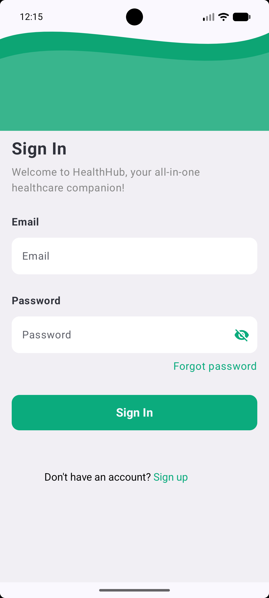
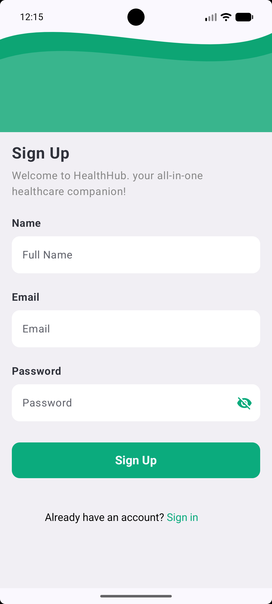
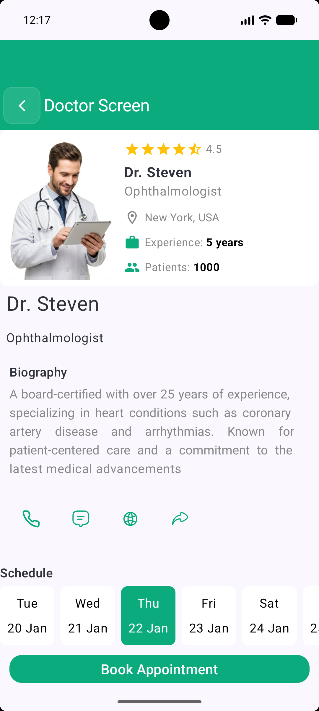
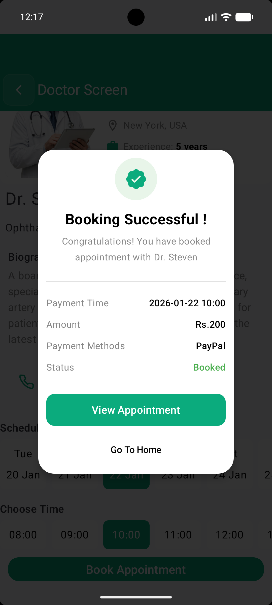
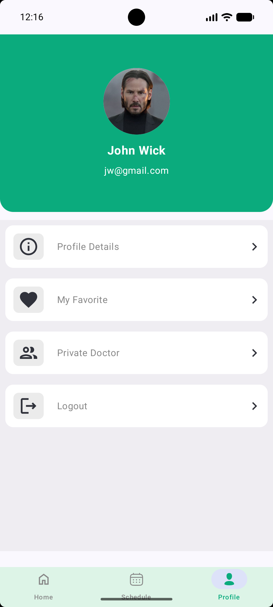

<div align="center">

# 🏥 Doctor Appointment App

### A modern Android application for seamless doctor appointment management


[Demo](#-demo-video) • [Features](#-features) • [Screenshots](#-screenshots) • [Tech Stack](#️-tech-stack) • [Installation](#-installation)

</div>

---

## 📖 Overview

A comprehensive doctor appointment booking application built with modern Android development practices. This app allows users to browse doctors, book appointments, manage their appointment history, and maintain their profile—all in one place with a beautiful, intuitive interface.

## ✨ Features

- 🔐 **User Authentication** - Secure sign in/sign up with Firebase
- 👨‍⚕️ **Doctor Directory** - Browse and search doctors by specialty
- 📅 **Appointment Booking** - Easy-to-use booking interface
- 📋 **Appointment History** - Track all your past and upcoming appointments
- 👤 **Profile Management** - Update your personal information
- 💾 **Offline Support** - Local data caching with Room database
- 🎨 **Modern UI** - Built with Jetpack Compose for smooth animations
- 🔄 **Real-time Sync** - Firebase integration for instant updates

## 🖼️ Screenshots

<div align="center">

| Intro Screen | Sign In | Sign Up | Home |
|:---:|:---:|:---:|:---:|
|  |  |  |  |

| Doctor Details | Booking | History | Profile |
|:---:|:---:|:---:|:---:|
|  |  |  |  |

</div>


## 🎥 Demo Video

<div align="center">

[](https://drive.google.com/file/d/1U0ZrEL5c9LUPayt7YJ7072qugYzubZ7j/view?usp=sharing)


</div>

## 🛠️ Tech Stack

<table>
<tr>
<td>

### 📱 Frontend
- **Kotlin** - Modern programming language
- **Jetpack Compose** - Declarative UI toolkit
- **Material 3** - Latest Material Design
- **Navigation Component** - Screen navigation

</td>
<td>

### 🔧 Architecture & Tools
- **MVVM Architecture** - Clean code structure
- **Dagger Hilt** - Dependency injection
- **Coroutines** - Asynchronous programming
- **Flow** - Reactive data streams

</td>
</tr>
<tr>
<td>

### 💾 Data & Storage
- **Room Database** - Local persistence
- **DataStore** - Preferences storage
- **Firebase Firestore** - Cloud database
- **Firebase Auth** - User authentication

</td>
<td>

### 🌐 Networking & APIs
- **Retrofit** - REST API client
- **OkHttp** - HTTP client
- **Gson** - JSON serialization
- **Coil** - Image loading

</td>
</tr>
</table>

### Technology Icons

<p align="left">
  
  
  
  
</p>

## 🏗️ Architecture

This project follows **Clean Architecture** principles with the **DDP pattern**:

```
app/
├── data/                    # Data Layer
│   ├── local/              # Room Database
│   ├── remote/             # Firebase & API calls
│   └── repository/         # Repository implementations
├── domain/                  # Domain Layer
│   ├── model/              # Business models
│   ├── repository/         # Repository interfaces
│   └── usecase/            # Business logic
└── presentation/           # Presentation Layer
    ├── ui/                 # Composable screens
    ├── viewmodel/          # ViewModels
    └── navigation/         # Navigation logic
```

### Layer Responsibilities

- **📊 Data Layer** - Handles all data operations (API calls, database queries)
- **💼 Domain Layer** - Contains business logic and use cases
- **🎨 Presentation Layer** - UI components and user interactions


### Setup Steps

1. **Clone the repository**
```bash
git clone https://github.com/yourusername/doctor-appointment-app.git
cd doctor-appointment-app
```

2. **Open in Android Studio**
   - Open Android Studio
   - Select "Open an Existing Project"
   - Navigate to the cloned directory

3. **Firebase Configuration**
   - Create a Firebase project at [Firebase Console](https://console.firebase.google.com/)
   - Download `google-services.json`
   - Place it in the `app/` directory
   - Enable Authentication and Firestore in Firebase Console

4. **Build and Run**
   - Sync project with Gradle files
   - Run on emulator or physical device

## 📦 Dependencies

```gradle
dependencies {
    // Jetpack Compose
    implementation "androidx.compose.ui:ui:1.6.0"
    implementation "androidx.compose.material3:material3:1.2.0"
    implementation "androidx.compose.ui:ui-tooling-preview:1.6.0"
    
    // Dagger Hilt
    implementation "com.google.dagger:hilt-android:2.50"
    kapt "com.google.dagger:hilt-compiler:2.50"
    
    // Room Database
    implementation "androidx.room:room-runtime:2.6.1"
    implementation "androidx.room:room-ktx:2.6.1"
    kapt "androidx.room:room-compiler:2.6.1"
    
    // Firebase
    implementation platform("com.google.firebase:firebase-bom:32.7.0")
    implementation "com.google.firebase:firebase-auth-ktx"
    implementation "com.google.firebase:firebase-firestore-ktx"
    
    // Retrofit
    implementation "com.squareup.retrofit2:retrofit:2.9.0"
    implementation "com.squareup.retrofit2:converter-gson:2.9.0"
    
    // Coroutines
    implementation "org.jetbrains.kotlinx:kotlinx-coroutines-android:1.7.3"
}
```

## 🔑 Key Features Explained

### 🔐 Authentication
- Email/Password authentication via Firebase
- Secure session management
- Auto-login for returning users

### 📅 Appointment System
- Real-time availability checking
- Conflict prevention
- Instant booking confirmation
- Easy cancellation/rescheduling

### 💾 Data Management
- Local caching for offline access
- Automatic sync when online
- Optimistic UI updates

## 🤝 Contributing

Contributions are welcome! Please follow these steps:

1. Fork the repository
2. Create a feature branch (`git checkout -b feature/AmazingFeature`)
3. Commit your changes (`git commit -m 'Add some AmazingFeature'`)
4. Push to the branch (`git push origin feature/AmazingFeature`)
5. Open a Pull Request


## 👨‍💻 Author

**[Himanshu Arya]**

- GitHub: [Himanshu Arya](https://github.com/hkarya625)

## 🙏 Acknowledgments

- [Firebase](https://firebase.google.com/) for backend services
- [Material Design](https://material.io/) for design guidelines
- [Android Developers](https://developer.android.com/) for excellent documentation

---

<div align="center">

### ⭐ Star this repository if you found it helpful!


</div>
